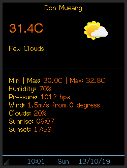
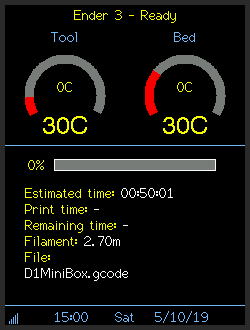
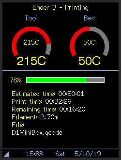
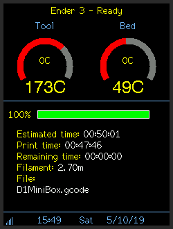

# 3d-print-monitor
OctoPrint monitor for 320x240 TFT displays and a ESP8266 processor. Built with Visual Studio Code and PlatformIO.

## Branches

Clone from the master branch for a working version. The dev branch should be considered a nightly / backup branch and will rarely work correctly.

## Features

* Creates an access point for connecting to any WiFi network.
* 2.8" colour TFT for display. Should work with any size 320x240 display handled by the TFT library.
* Uses a cheap ESP8266 board as the controller.
* OctoPrint Monitor - monitor one 3D printer through Octoprint. (I'm planning to extend the code to allow multiple printers to be monitored)
* 2 different display modes. All display modes show WiFi strength, clock with date and time and use colourful icons.
  * Detailed current weather from OpenWeather.
  * OctoPrint monitor mode.
* All settings controlled through a web interface.
* Uses OpenWeather API for retrieving current weather.
* Can perform screengrabs and send them to a Processing sketch over serial connection.
* Password protected OTA updates enabled through PlatformIO (not through the web interface).

## Example screens

## API

Uses the [OpenWeather](https://openweathermap.org/api) API for current conditions. You will need an API key and the ID of the location to display weather.

## Required Libraries

* ArduinoJson
* ESPAsyncWiFiManager
* ESPAsyncTCP
* ESPAsyncWebServer
* TaskScheduler
* TFT_eSPI
* NTPClient

Big thanks to all the library developers who make developing projects such as this simple.

## Hardware

Built using the following hardware from AliExpress.

[Wemos D1 mini ESP8266 board](https://www.aliexpress.com/item/32651747570.html)  
[2.8" TFT non touch version](https://www.aliexpress.com/item/33012793224.html)  

Development was done on NodeMCU and Wemos D1 Mini boards. Any TFT with a 320x240 display that works with the TFT_eSPI library should work but has not been tested.

## Wiring

    Mini RST -> TFT RST  
    Mini D0  -> TFT LED (for display brightness control, hope this is OK, just connect TFT LED to VCC if worried)
    Mini D5  -> TFT SCK  
    Mini D6  -> TFT MISO (only required if screen grab feature required)  
    Mini D7  -> TFT MOSI  
    Mini D8  -> TFT CS
    Mini D3  -> TFT DC  

Connect VCC and GND on the TFT to the respective pins on the Mini or NodeMCU.

## Note

There is a setting in the TFT_eSPI library that has to be set the same as you wire the TFT to the Mini. With the above wiring no changes should be required.
Open User_Setup.h in the TFT_eSPI library folder and set the following to suit your build:

    // ###### EDIT THE PIN NUMBERS IN THE LINES FOLLOWING TO SUIT YOUR ESP8266 SETUP ######

    // For NodeMCU - use pin numbers in the form PIN_Dx where Dx is the NodeMCU pin designation
    #define TFT_CS   PIN_D8  // Chip select control pin D8
    #define TFT_DC   PIN_D3  // Data Command control pin
    #define TFT_RST  PIN_D4  // Reset pin (could connect to NodeMCU RST, see next line)
    //#define TFT_RST  -1    // Set TFT_RST to -1 if the display RESET is connected to NodeMCU RST or 3.3V

## UserSettings.h

Contains defines for MD5 password hash if you want to use OTA for future updates. The SCREEN_ROTATION define should be set depending on if your screen is pins up or pins down in it's case.

## OTA updates

Password protected OTA updates enabled. Set the MD5 hash of your prefered password in UserSettings.h. To upload via IP in PlatformIO create a file called uploadPassword.ini in the same folder as platformio.ini with the following contents:

    [password]
    upload_password = xxxxx
    
Replace xxxxx with the plain text version of your MD5 hash set above. [MD5 Generator.](https://www.miraclesalad.com/webtools/md5.php)

## OctoPrint Monitor

OctoPrint monitor can monitor one 3D printer. Set up your OctoPrint host and API key on the OctoPrint Monitor settings page.

## Case

There isn't a custom case design yet. You can use any suitable 2.8" TFT D1 / NodeMCU case, many are available on ThingiVerse such as [2.4" & 2.8" TFT Desktop stand](https://www.thingiverse.com/thing:2172068)

## Thanks

[Weather icons](https://www.deviantart.com/umutavci/art/weather-icon-set-165476034) from umutavci.  
Inspired by [ThingPulse color weather station](https://github.com/ThingPulse/esp8266-weather-station-color) and [printer-monitor](https://github.com/Qrome/printer-monitor/tree/3.0).

